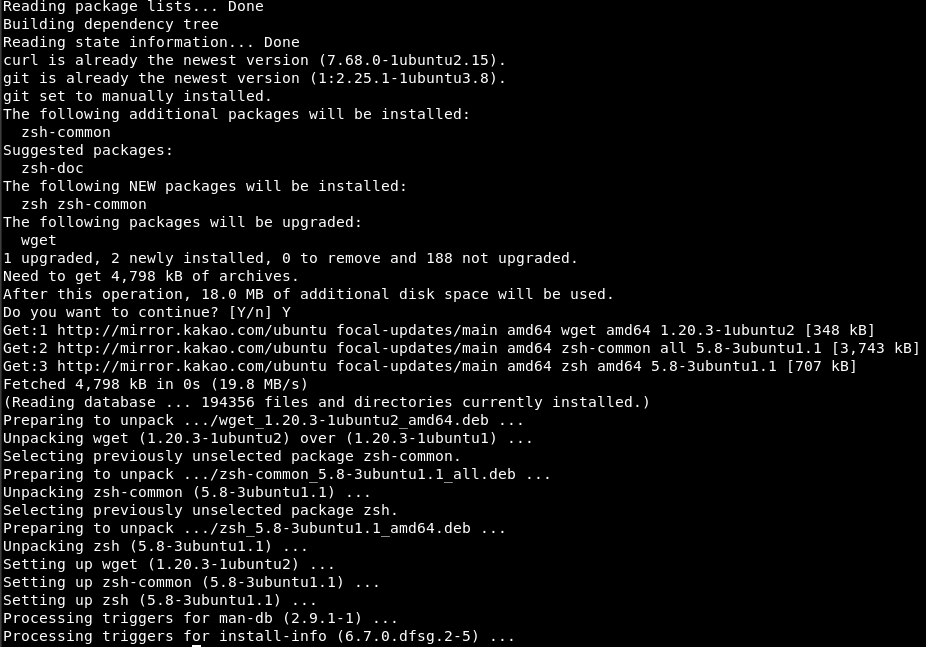
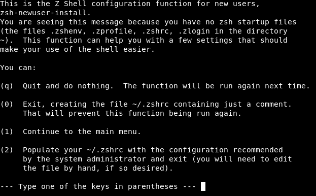
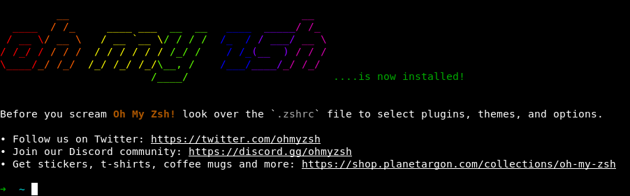
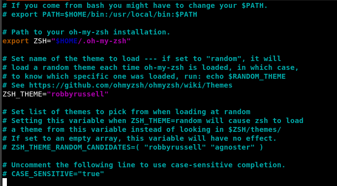

# Ubuntu 에 Oh My Zsh 설치하기
## 설치전 요구사항
- zsh 설치 되어 있어야함 (V5.0.8 또는 그 이상)
- Curl or Wget 이 설치되어 있어야함
- Git 이 설치 되어 있어야함 (V2.4.11 또는 그 이상)

- 설치 command
   ```shell
   $ sudo apt install curl wget git
   ```

- 설치 결과 화면
  

- 터미널 기본 셀 변경
```shell
chsh -s $(which zsh)
```
- zsh 를 설치 후 chsh 명령어를 통해 기본 shell 을 변경
- 터미널을 재시작 하면 자동으로 zsh 설정 화면이 나오는데, 0을 입력해서 파일 생성만 한다.

  


## OH-MY-ZSH 설치


```shell
$ sh -c "$(curl -fsSL https://raw.github.com/ohmyzsh/ohmyzsh/master/tools/install.sh)"
OR
$ sh -c "$(wget https://raw.github.com/ohmyzsh/ohmyzsh/master/tools/install.sh -O -)"
```

- 설치 결과 화면
  

- .zshrc 폴더를 열고 테마를 바꿔줍니다.
```shell
vim ~/.zshrc
```




- 하기 링크에서 원하는 테마로 선택해서 바꿔주면 됩니다. 
  https://github.com/ohmyzsh/ohmyzsh/wiki/themes

- agnoster 테마로 변경 완료

  

- 터미널을 재시작 하면 바뀐 터미널을 확인 가능 합니다.

  